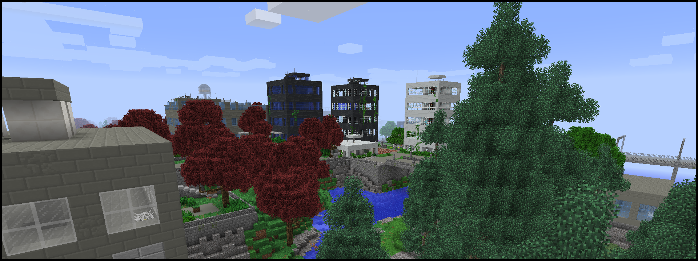

# #obsidian 1.12.2 Modpack

This modpack is by and for the **#obsidian Research** community. It's a kitchen-sink-y modpack with focus on Technology, Automation, Magic and Building, as per our interests. A list of mods can be found [here](packs/obsidian12pack.voodoo.kts) - sorted and annotated!



We use the modpack development tool [Voodoo](https://github.com/DaemonicLabs/Voodoo) for easier development, version control, management of mods, keeping them up-to-date, and to have a self-updating MultiMC instance for our players.

## Download and Installation

### Prerequisites

Before you start out, make sure you have a **64bit Java 8 Runtime** installed. To check open a command line (on Windows, press `Win+R`, type `cmd` and press Enter) and enter the command `java -version`. You should see something like the following:

```
openjdk version "1.8.0_242"
OpenJDK Runtime Environment (AdoptOpenJDK)(build 1.8.0_242-b08)
OpenJDK 64-Bit Server VM (AdoptOpenJDK)(build 25.242-b08, mixed mode)
```

If you don't have Java 8 or are using the 32bit version, we recommend just installing [OpenJDK provided by AdoptOpenJDK](https://adoptopenjdk.net/?variant=openjdk8&jvmVariant=hotspot), because Oracle is dumb and now requires you to create an account on their website to download their old releases.

### MultiMC Setup

Simply drag this link >> [`obsidian12pack.zip`](https://meowface.org/copygirl/obsidian12pack.zip) << and drop it into the main [MultiMC](https://multimc.org/) window to create a new instance.

Since we're currently too lazy, you may need to adjust the memory limits for the modpack. To do that, right click and "Edit Instance", select "Settings", then activate the "Memory" checkbox. We recommend allocating 6 GB (6144 MB) to the modpack, so insert that in both textboxes.

If you have multiple Java installations (such as Java 8 and Java 11), this same tab allows you to select which one of those to use. Forge for Minecraft 1.12 only supports Java 8.

On first launch, an error will likely appear; in this case just launch it again. It will then ask you which optional mods you want and download everything for you before starting the game.

### In-game Preparations

If you want to create a new singleplayer world, we recommend the "Lost Cities (BoP)" world type, for which we've created a custom profile. Alternatively, set these options in the `server.properties` if you're creating your own server:

```ini
level-type=lostcities_bop
generator-settings={"profile"\:"custom"}
```

If you'd like to play on the official server, feel free to poke @copygirl.
